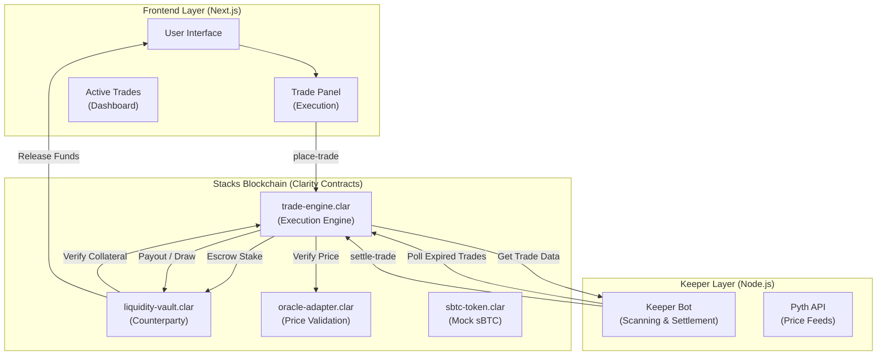

# BitOracle: Per-Trade Settlement Architecture

BitOracle has evolved from a round-based prediction market to a **Per-Trade Settlement Model**. This redesign enables instant execution, where every user starts their own independent market upon placing a bet.

---

## 🏗 System Architecture

The system is designed for high-frequency interaction, removing the bottleneck of admin-created rounds.



---

## 📜 1. Smart Contract Layer

### A. `trade-engine.clar` (The Core Engine)
Replaces the old round-based model. It manages individual trade timers and outcomes.
- **Trade States**: `0=open`, `1=won`, `2=lost`, `3=draw`.
- **Dynamic Timers**: Expiry is calculated as `burn-block-height + (timeframe_multiplier * blocks_per_unit)`.
- **Direct Settlement**: Trades are settled individually, allowing for precise point-in-time price matching.

### B. `liquidity-vault.clar` (The Counterparty)
A specialized vault that acts as the "House."
- **Solvency Checks**: The `trade-engine` queries the vault before allowing a trade to ensure the house can cover the potential payout.
- **Auto-Payout**: Wins are pushed directly from the vault to the user's wallet via contract-to-contract calls.

### C. `oracle-adapter.clar`
Provides a unified interface for the keeper to submit high-precision price data (8 decimal places) retrieved from Pyth.

---

## 🤖 2. Keeper Layer (Off-Chain Automation)

The Keeper is now far more autonomous. Instead of checking a few rounds, it scans the `trades` map for any trade whose `expiry-block` is less than or equal to the current `burn-block-height`.

1. **Market Scanning**: Polls the trade counter and iterates through recent trades.
2. **Precision Settlement**: Fetching the exact BTC price from Pyth Hermes at the moment of settlement.
3. **Outcome Calculation**: Determines the winner based on `close-price` vs `entry-price` and broadcasts the settlement transaction.

---

## 💻 3. Frontend Implementation

### Execution Panel
- Users select from four timeframe presets (30s, 1m, 5m, 15m).
- Payout rates are displayed dynamically based on selected risk/duration.
- **[NEW]** Real-time `lightweight-charts` integration fetching BTC/USD data from Pyth.
- Real-time "Potential Profit" calculation in sBTC.

### Active Positions
- A dedicated dashboard tracks the user's open trades with live status updates.
- Custom scrollbar and premium backdrop-blur styling for a professional trading feel.

---

## 🛠 4. Getting Started (Deployment)

### 1. Smart Contracts
Deploy using Clarinet:
```bash
cd bitoracle
clarinet integrate
```

### 2. Keeper Setup
```bash
cd keeper
# Ensure .env has the correct CONTRACT_ADDRESS and KEEPER_PRIVATE_KEY
npm install
npm run start
```

### 3. Frontend Setup
```bash
cd frontend
npm install
npm run dev
```

> [!IMPORTANT]
> **Liquidity Seeding**: The system will reject trades if the vault is empty. Use the `seed-vault` function in `liquidity-vault.clar` to fund the house with sBTC before starting.
